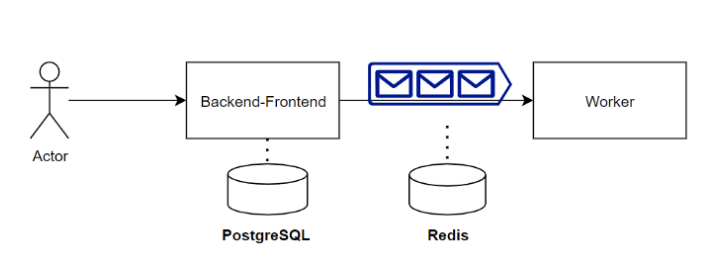

# 1. Overview

- Backend : Django 
- Frontend : Bootstrap and Highchats
- Message and Queue : Celery and Flower

Lib I used to build Auto machine learning :
- Autogluon



# 2. Install

## 2.1 Database
- Redis
- PostgreSQL

## 2.2 Python env
I'm using Miniconda to managing python environment. If you don't have miniconda, please check below link
https://docs.conda.io/en/latest/miniconda.html

**Step 1.** Create env with miniconda 
```commandline
conda create --name env python=3.7
conda activate env
```

**Step 2.** Install required packages
```commandline
pip install -r src/requirements.txt
```


##  2.3 Edit config file

Config file located at
```commandline
\src\mlplatform\settings.py
```

*Step 1. Edit PostgreSQL config*

```commandline
DATABASES = {
    'default': {
        'ENGINE': 'django.db.backends.postgresql',
        'NAME': '<DB NAME>',
        'USER': '<USER NAME>',
        'PASSWORD': '<PASSWORD>',
        'HOST': '<YOUR_POSTGREDB_IP>',
        'PORT': 5432,
    }
}
```
*Step 2. Edit Redis config*
```commandline
CELERY_BROKER_URL = 'redis://:@<REDIS_IP>:6379'
CELERY_RESULT_BACKEND = 'redis://:@<REDIS_IP>:6379'
```

# 3. Start Service

Make sure you run bellow comment inside /easyml/src folder

*Step 1. Init database*
```commandline
# Init tables. Run this comment only first time or when you change your DB
python manage.py makemigrations
python manage.py migrate
```

*Step 2. Start Service*
```commandline
# Start django service
python manage.py runserver --noreload

# Start celery flower service
celery -A mlplatform flower --port=5555 

# Start worker
celery -A mlplatform worker -s /tmp/tmp.db --pool=solo -l info
```